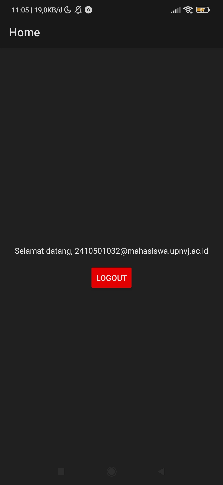
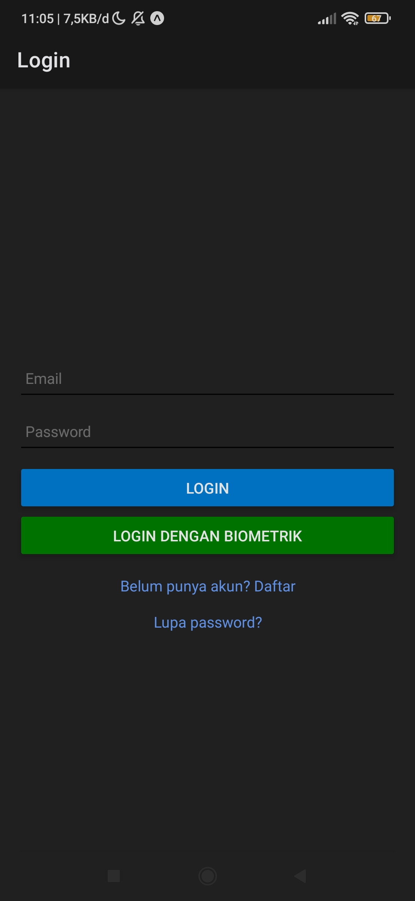
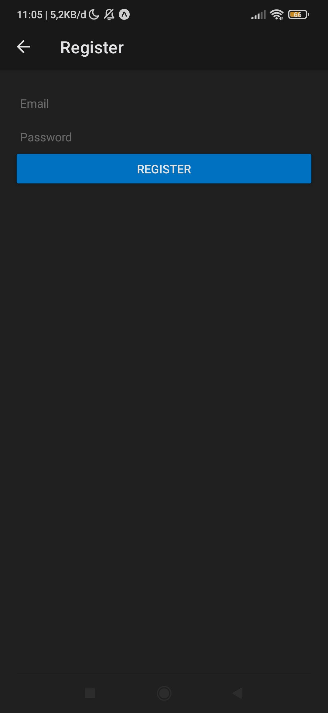
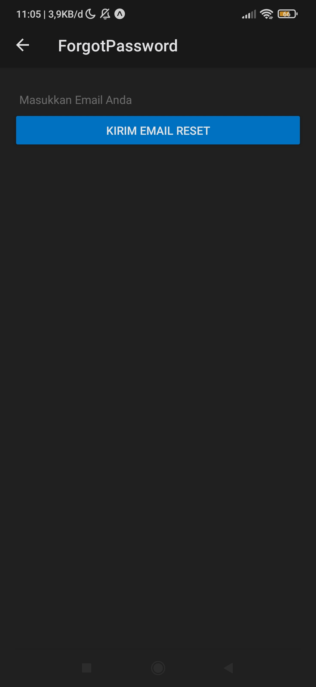

# Authentication & Authorization
---

## Identitas Pengembang

- **Nama**  : Arzza Munabim
- **NIM**   : 2410501032
- **Kelas** : Pemrograman Mobile Lanjut - B
---

## Cara Run Project

Pastikan Anda sudah menginstall Node.js dan aplikasi Expo Go di smartphone.

1.  **Clone Repository**
    ```bash
    [git clone (https://github.com/ArzaVie/p9-Authentication-Authorization)]
    cd 
    
    ```
2.  **Install Dependencies**
    ```bash
    npm install
    ```
3.  **Run Metro Bundler**
    ```bash
    npx expo start -c
    ```
4.  **Scan QR Code**: Buka aplikasi **Expo Go** di Android/iOS dan scan QR Code yang muncul di terminal.

---

## Screenshots

| Home                             | Login Screen                        | Register                               | Lupa Password                           |
| -------------------------------- | ------------------------------------ | ------------------------------------ | ----------------------------------- |
|  |  |  |  | 

---

## Video Demo

- [Klik di sini untuk menonton Video Demo Aplikasi (Youtube)](https://youtu.be/aemLpFPZ5As?si=IQy_sQkj0ldctaoe)
---
## Referensi

- [React Navigation Docs](https://reactnavigation.org/docs/getting-started) untuk struktur navigasi.
- [React Navigation Docs](https://reactnavigation.org/docs/getting-started) - Untuk referensi struktur navigasi *Stack* dan *Bottom Tabs*.
- [Open Library API Documentation](https://openlibrary.org/developers/api) - Referensi struktur *endpoint* untuk fitur *Search*, *Works* (Detail), dan *Trending Books*.
---